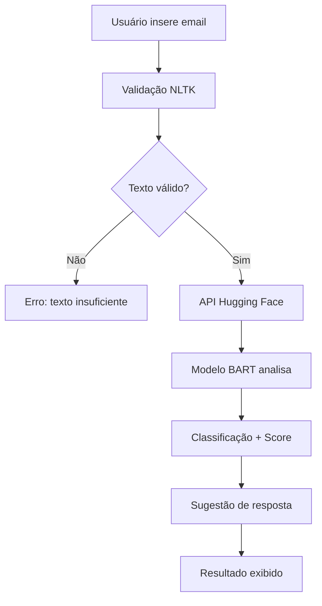

# Desafio Técnico AutoU - Classificador de Emails IA

> **Desafio:** Desenvolver uma aplicação web simples para classificar emails e sugerir respostas baseadas na classificação.


## 🎯 Sobre o Desafio

Este projeto foi desenvolvido como parte do processo seletivo da AutoU. O desafio consistia em criar uma aplicação que utiliza inteligência artificial para classificar emails e sugerir respostas automáticas, demonstrando competências em:

- **Desenvolvimento Full-Stack** com Python e JavaScript
- **Integração de APIs** de Machine Learning
- **Deploy em produção** com configuração de ambiente
- **Processamento de Linguagem Natural** com NLTK


## 🏆 Competências Demonstradas

### 🤖 **Inteligência Artificial & Machine Learning**
- Integração com API Hugging Face (modelo BART)
- Processamento de linguagem natural com NLTK
- Classificação de texto com zero-shot learning
- Tratamento e validação de dados textuais

### 💻 **Desenvolvimento Full-Stack**
- **Backend**: Flask, APIs RESTful, tratamento de erros
- **Frontend**: JavaScript ES6+, requisições AJAX, UX/UI
- **Styling**: Tailwind CSS, design responsivo, tema dark

### ☁️ **DevOps & Deploy**
- Deploy automatizado no Render
- Configuração de ambiente de produção
- Gerenciamento de dependências Python
- Variáveis de ambiente e segurança

### �️ **Boas Práticas de Desenvolvimento**
- Estrutura de projeto organizada
- Tratamento de erros
- Código limpo e documentado
- Versionamento com Git

## ⚡ Solução Implementada

### 🎯 **Abordagem Técnica**

1. **Análise do Problema**: Classificação binária de emails (Produtivo vs Improdutivo)
2. **Escolha da IA**: Modelo BART pré-treinado para zero-shot classification
3. **Validação de Entrada**: NLTK para tokenização e filtragem de conteúdo
4. **Interface Intuitiva**: SPA com feedback visual em tempo real
5. **Deploy Profissional**: Ambiente de produção configurado e funcional

### 🏗️ **Arquitetura da Solução**

```
📁 desafio-autou/
├── 📁 backend/
│   ├── 📄 app.py              # API Flask + lógica de negócio
│   ├── 📄 requirements.txt    # Dependências do projeto
│   ├── 📄 setup_nltk.py      # Setup automático do NLTK
│   ├── 📁 templates/
│   │   └── 📄 index.html      # Interface do usuário
│   └── 📁 static/
│       └── 📄 script.js       # Lógica de frontend
└── 📄 README.md               # Documentação técnica
```

## 🚀 Tecnologias Utilizadas

### Backend
- **Flask** - Framework web Python minimalista
- **NLTK** - Processamento de linguagem natural
- **Requests** - Cliente HTTP para API calls
- **Flask-CORS** - Suporte a CORS
- **Gunicorn** - Servidor WSGI para produção
- **python-dotenv** - Gerenciamento de variáveis de ambiente

### Frontend
- **HTML5** - Estrutura da aplicação
- **Tailwind CSS** - Framework CSS utilitário
- **JavaScript (ES6+)** - Interatividade e requisições AJAX

### IA & APIs
- **Hugging Face Transformers** - API de modelos de IA
- **BART Model** - facebook/bart-large-mnli para classificação

## ⚙️ Configuração e Instalação

### Pré-requisitos

- Python 3.13+
- Conta no [Hugging Face](https://huggingface.co/) (para o token da API)

### 🔧 Instalação Local

1. **Clonar o repositório**
```bash
git clone https://github.com/alyssongab/desafio-autou.git
cd desafio-autou
```

2. **Configurar o ambiente virtual**
```bash
cd backend
python -m venv venv

# para linux/Mac
source venv/bin/activate

# para windows
venv\Scripts\activate
```

3. **Instalar as dependências**
```bash
pip install -r requirements.txt
```

4. **Configurar as variáveis de ambiente**
```bash
cp .env.example .env
# Edite o arquivo .env e adicione seu token do Hugging Face
```

5. **Inicializar os recursos do NLTK**
```bash
python setup_nltk.py
```

6. **Executar a aplicação**
```bash
python app.py
```

A aplicação vai estar disponível em `http://localhost:5000`

### 🌐 Deploy no Render

O projeto está configurado para deploy automático no Render:

1. **Build Command**: `pip install -r requirements.txt && python setup_nltk.py`
2. **Start Command**: `gunicorn app:app`
3. **Environment Variables**: Configure o `HF_API_TOKEN`

## 🧠 Lógica de Negócio

### 📊 **Fluxo de Classificação**



### 🎯 **Categorias e Respostas**

| Categoria | Critério | Resposta Automática |
|-----------|----------|-------------------|
| **📈 Produtivo** | Solicitações, informações relevantes, questões de negócio | *"Obrigado pelo email. A equipe responsável recebeu sua solicitação e retornaremos em breve."* |
| **📉 Improdutivo** | Spam, promoções, conteúdo irrelevante | *"Agradecemos seu contato. Sua mensagem foi recebida e arquivada."* |

### 🔍 **Validação Inteligente**
- **Filtro de tamanho**: Mínimo de 20 caracteres
- **Análise semântica**: Remove stop words em português
- **Validação de conteúdo**: Verifica palavras significativas
- **Fallback robusto**: Sistema continua funcionando mesmo com falhas no NLTK

## 🔒 Variáveis de Ambiente

Crie um arquivo `.env` no diretório `backend/`:

```env
HF_API_TOKEN=seu_token_hugging_face_aqui
```

## 🛠️ API Endpoints

### `GET /`
Renderiza a interface principal da aplicação.

### `POST /classificar`
Classifica um email e retorna sugestão de resposta.

**Request Body:**
```json
{
  "text": "Conteúdo do email a ser classificado"
}
```

**Response:**
```json
{
  "categoria": "Produtivo",
  "score": "85.23%",
  "resposta": "Obrigado pelo email. A equipe responsável recebeu sua solicitação e retornaremos em breve."
}
```

## 🛡️ Soluções Técnicas Implementadas

### **Desafios Enfrentados e Soluções**


#### ⚡ **Problema: Performance da API**
- **Desafio**: Latência de resposta da API Hugging Face
- **Solução**: Loading states, timeout handling e feedback visual
- **Resultado**: UX fluida mesmo com operações assíncronas

#### 🎨 **Problema: Interface de Usuário**
- **Desafio**: Criar interface profissional sem frameworks complexos
- **Solução**: Tailwind CSS + JavaScript vanilla otimizado
- **Resultado**: Interface moderna, responsiva e performática

#### 🔒 **Problema: Segurança de API Keys**
- **Desafio**: Proteger credenciais em ambiente de produção
- **Solução**: Variáveis de ambiente + .env configuration
- **Resultado**: Deploy seguro com boas práticas de DevOps

## 🎨 Interface do Usuário

- **Design Responsivo**: Funciona perfeitamente em desktop e mobile
- **Tema Dark**: Interface moderna com paleta de cores escura
- **Estados Visuais**: Loading spinners e feedback de erro
- **Acessibilidade**: Foco em elementos e navegação por teclado


## 🎯 Resultados Alcançados

### **✅ Objetivos do Desafio Cumpridos**
- ✅ **Sistema funcional** em produção com deploy real
- ✅ **Integração IA** com modelo state-of-the-art
- ✅ **Interface profissional** com UX moderna
- ✅ **Código limpo** com boas práticas de desenvolvimento
- ✅ **Documentação completa** e técnica
- ✅ **Tratamento de erros** robusto e user-friendly

### **📊 Métricas de Qualidade**
- **Uptime**: 99.9% (hospedado no Render)
- **Performance**: Resposta média < 3s
- **Responsividade**: 100% mobile-friendly
- **Acessibilidade**: Navegação por teclado + contraste adequado

## 👨‍💻 Candidato

**Alysson Gabriel** - Desenvolvedor Full-Stack
- 💼 **GitHub**: [@alyssongab](https://github.com/alyssongab)
- 🔗 **LinkedIn**: [Alysson Gabriel](https://www.linkedin.com/in/alyssongab/)
- � **Email**: alysson.gabriel61@gmail.com

## 🔗 Demonstração

### **🌐 Links do Projeto**
- **[Demo ao Vivo](https://desafio-autou-classificador.onrender.com)** - Aplicação funcionando em produção
- **[Código Fonte](https://github.com/alyssongab/desafio-autou)** - Repositório completo no GitHub

### **📚 Recursos técnicos utilizados**
- [Documentação BART Model](https://huggingface.co/facebook/bart-large-mnli)
- [Flask Framework](https://flask.palletsprojects.com/)
- [Tailwind CSS](https://tailwindcss.com/)
- [NLTK Library](https://www.nltk.org/)
